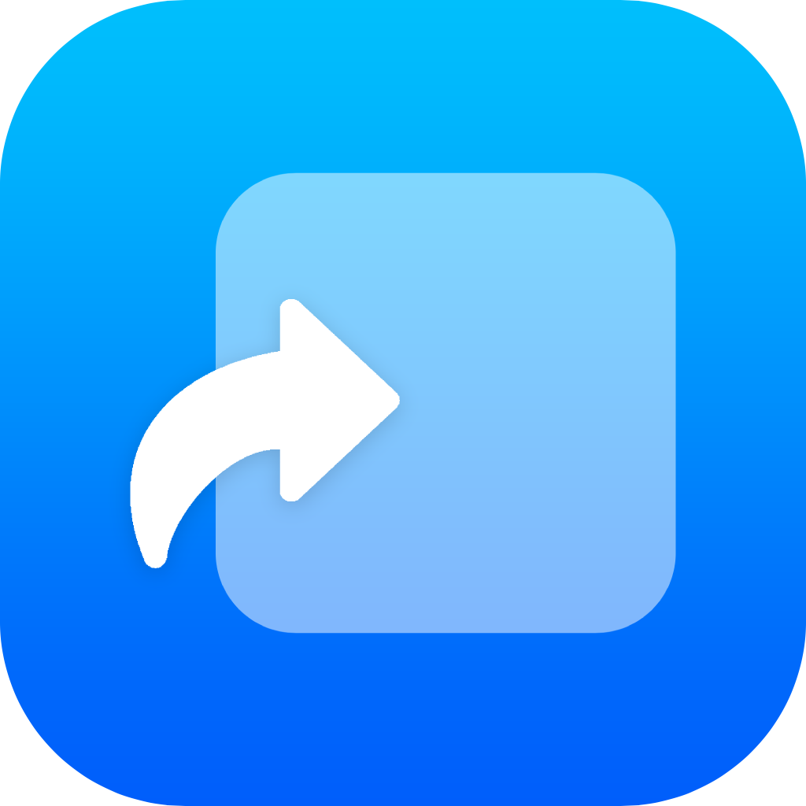

# TrollApps
App Store, but for TrollStore

# WARNING!!!
App is crashing now because the website is banned. Will be fixed within a week or two.

# What's this?
As the description says, "App Store, but for TrollStore". The App fetches an API from my website and loads a list of popular TrollStore apps to download. Then when you press the "GET" button the app opens the url scheme (apple-magnifier://install?url=) to TrollStore which downloads and installs the you have chosen app. All of this means also if whenever an app update of a TrollStore app which is in the list is out, I just have to update a variable in the API and won't need to have to update TrollApps and you would need to install the new version of it. You need to have a WiFi or either a cellular connection for this to work! **This works for iOS 14.0 and up, make sure to be on the latest version of TrollStore**

# Want to submit an app?
If you want to submit an app, DM me on Twitter with the request. My Twitter is @haxi0sm

