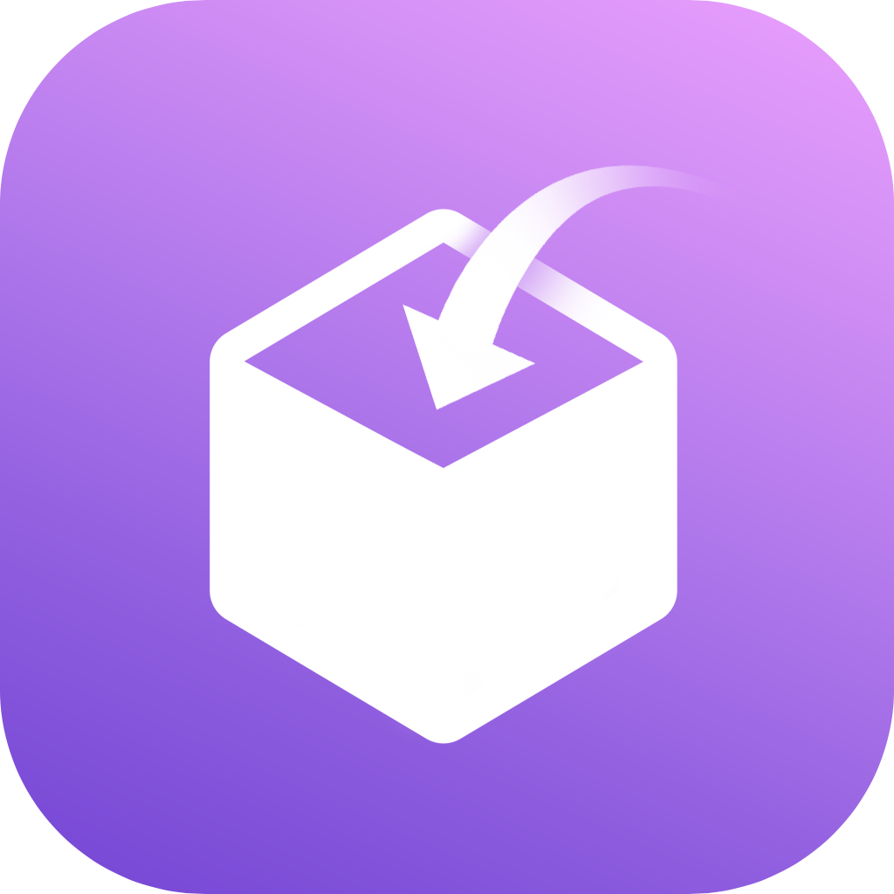
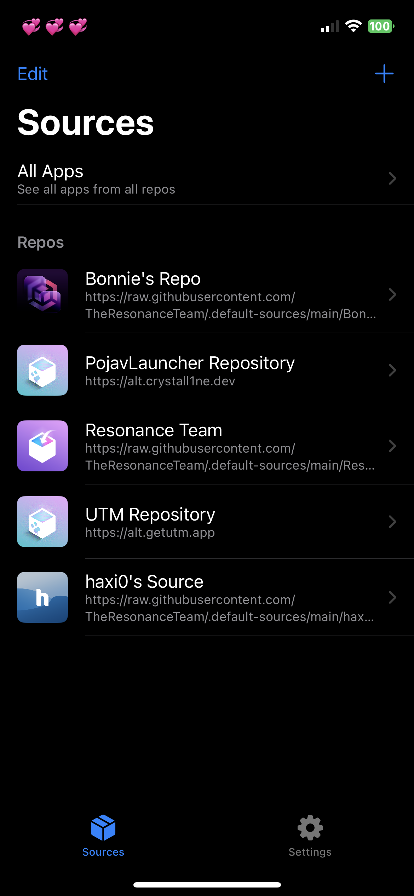
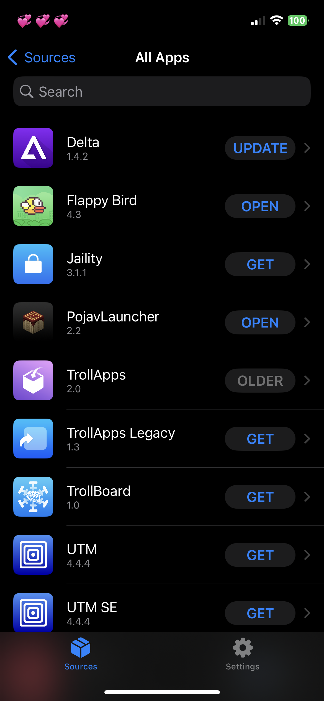
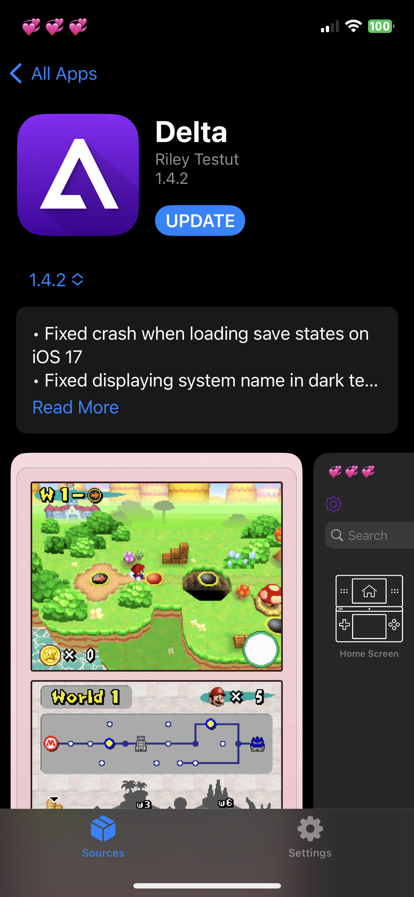

    </img>

<h1 align="center">TrollApps</h1>
<h6 align="center">An App Store alternative for TrollStore.</h6>

# What is TrollApps?
TrollApps is an alternative to the iOS App Store for TrollStore users. TrollApps allows users to download apps from repositories and install them directly in TrollStore. **TrollApps works on iOS 14.0 and up; make sure to be on the latest version of TrollStore.**

# Requirements
You require a TollStore 1.0 / 2.0 compatible device, and TrollStore must be installed to use this application. It is also required that you enable schema urls within TrollStore.

#

    </img>
    </img>
    </img>

# Found a bug / want to send feedback? 
<h3>Join our <a href="https://discord.gg/PrF6XqpGgX">Discord</a>!</h3>

